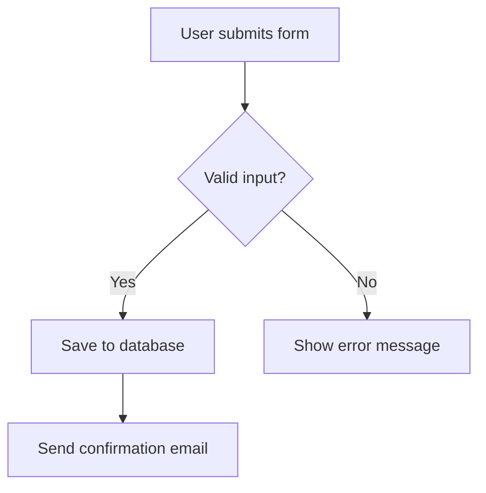
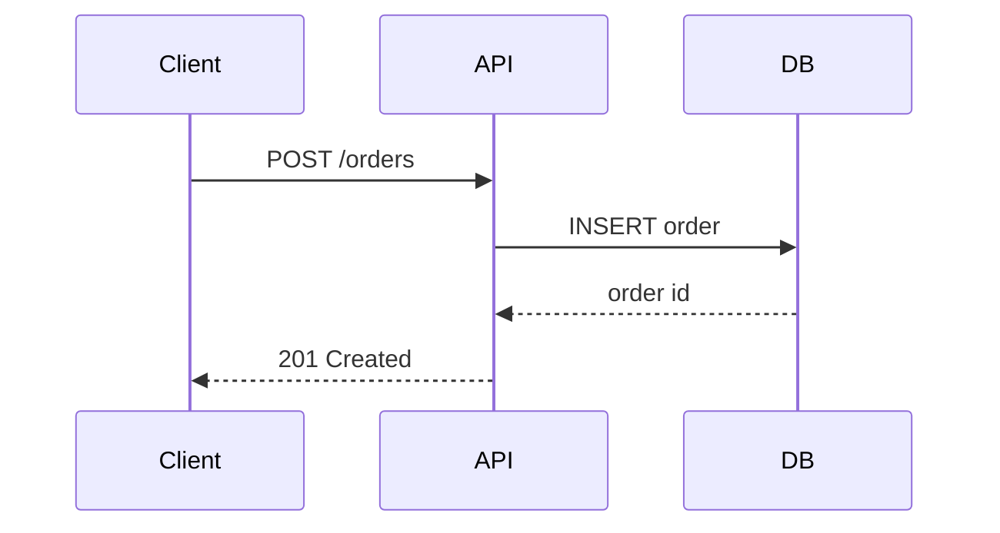
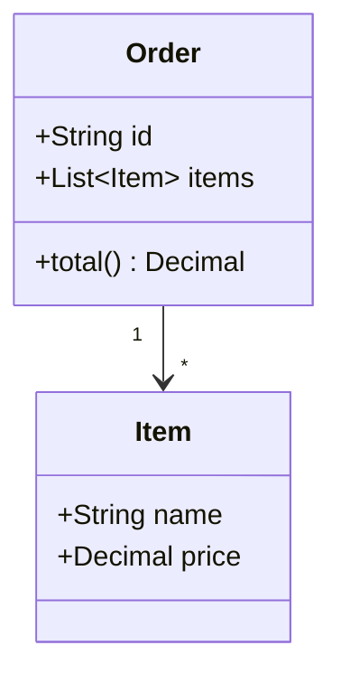
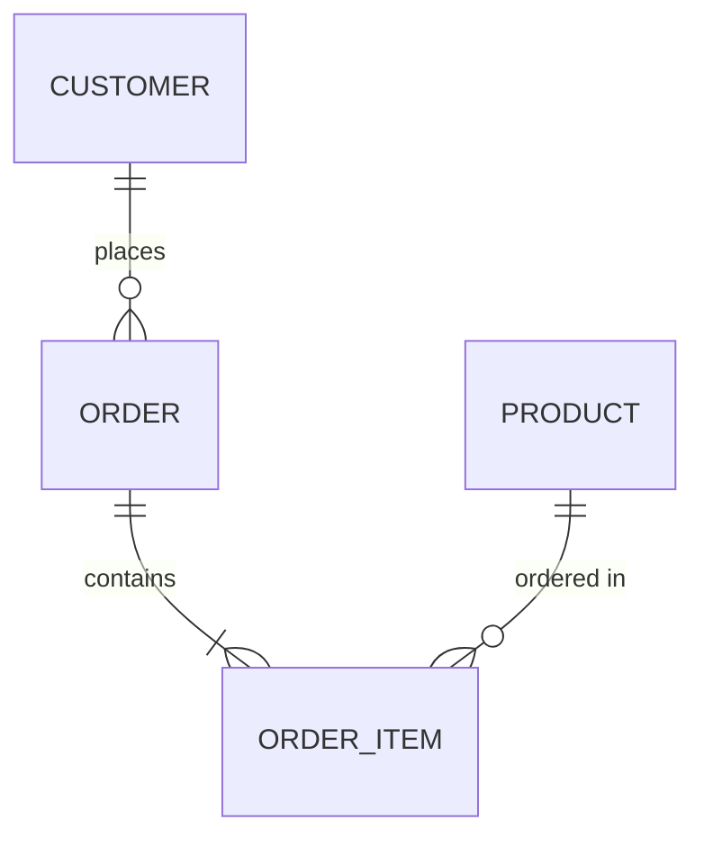
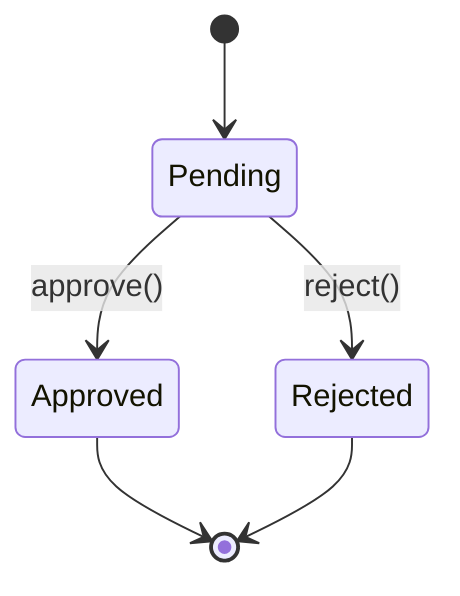
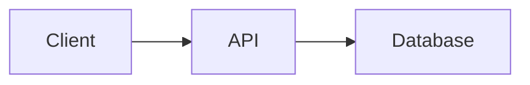

# Use Mermaid for Diagrams in Markdown

## Core rule

When a `.md` file needs a diagram, write it as a fenced ```mermaid``` code block. Do not draw it with ASCII art (lines made of `-`, `|`, `+`, `>`, boxes made of characters).

## Why this matters

- **It renders as a real picture.** GitHub, GitLab, and most Markdown viewers turn a mermaid block into an actual diagram with boxes and arrows. ASCII art stays as plain text — the reader has to imagine the shape.
- **It is easier to edit.** To move a box or add a step in ASCII art, you must re-align every line by hand. In Mermaid, you just add or change one line of text.
- **It scales.** A 3-box ASCII diagram is fine. A 10-box one turns into a mess of misaligned characters. Mermaid stays clean no matter how big the diagram gets.

## Pick the right diagram type

Look at what you want to show, then pick the matching Mermaid type:

| You want to show... | Use this diagram type | First line of the block |
|---|---|---|
| A process, a decision tree, system architecture | Flowchart | `flowchart TD` (or `LR` for left-to-right) |
| Messages or calls between people/services over time | Sequence diagram | `sequenceDiagram` |
| Classes, objects, and how they relate | Class diagram | `classDiagram` |
| Database tables and their relations | ER diagram | `erDiagram` |
| A state machine (states and what triggers a change) | State diagram | `stateDiagram-v2` |
| A timeline of tasks | Gantt chart | `gantt` |

If you are not sure which type fits, ask: "Is this about **time and order** (things happening one after another) or **structure** (how things are connected)?" Sequence and state diagrams are about order. Flowchart, class, and ER diagrams are about structure.

## Examples

**Flowchart** — a process or architecture:



**Sequence diagram** — interaction over time:



**Class diagram** — structure of code:



**ER diagram** — data model:



**State diagram** — a state machine:



## Do / Don't

**❌ Don't** (ASCII art)

```markdown
  +--------+       +--------+       +----------+
  | Client | ----> |  API   | ----> | Database |
  +--------+       +--------+       +----------+
```

**✅ Do** (Mermaid)

```markdown

```

## Keep the syntax correct

- Always name the diagram type on the first line inside the block (`flowchart TD`, `sequenceDiagram`, etc.) — a mermaid block with no type keyword fails to render.
- Node IDs (the short names like `A`, `B`, `Client`) cannot contain spaces; put the human-readable label in brackets instead, e.g. `A[User submits form]`.
- Keep arrow syntax per diagram type: flowcharts use `-->`, sequence diagrams use `->>` (call) and `-->>`  (reply), state diagrams use `-->`.
- If the diagram is going to be read by someone, not just Claude, mentally render it (or ask the user to preview it) before trusting complex syntax — a typo in arrow syntax fails silently as unrendered text in some viewers.
